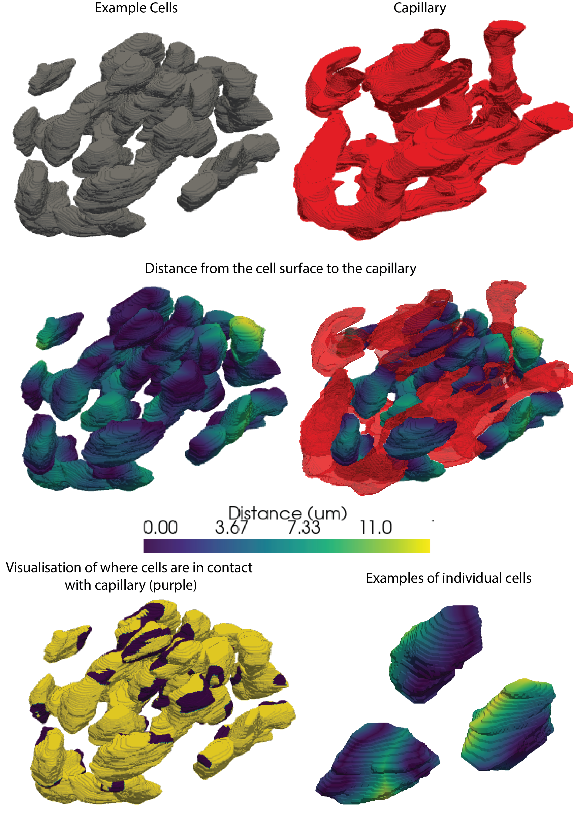
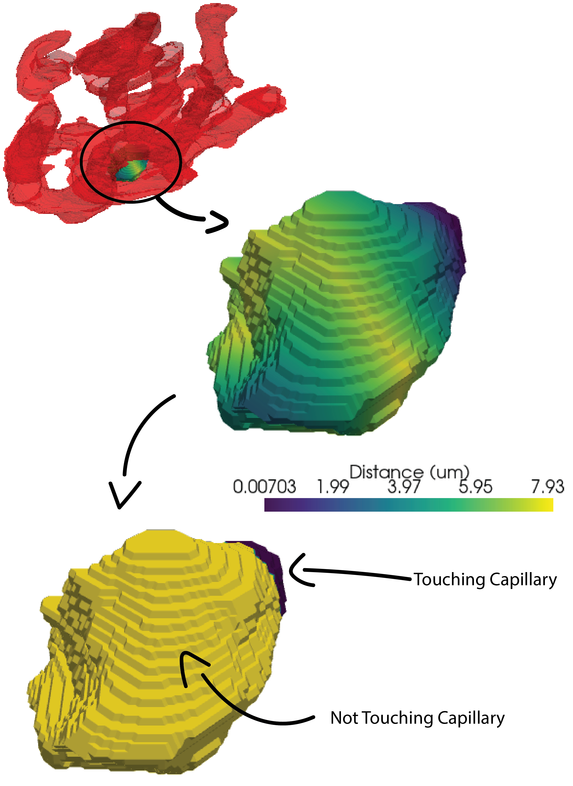

# 3D Diabetic Islets

Workflow to take 3D segmented images of islet cells and capillary and qunaitify the contacts between cells and the capillary. Work is documentd in a jupyter notebook and images will be availble upon publication. .

## Example Figure 1
Shows a 3D render of the cells along with cpaillary and the distance between every cell surface to the nearest capillary surface. 

## Example Figure 2
Highlights how distance metrics are calculated for individual cells 
     

